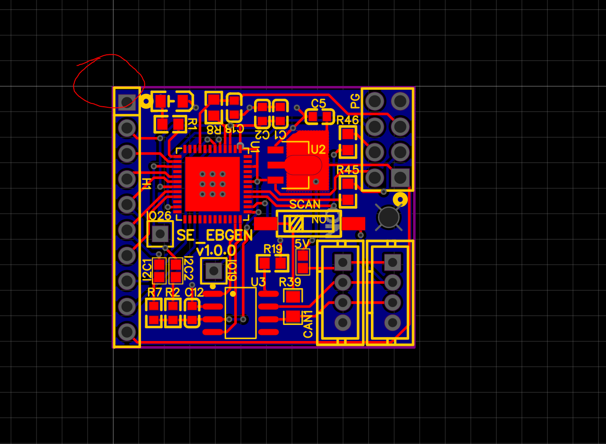
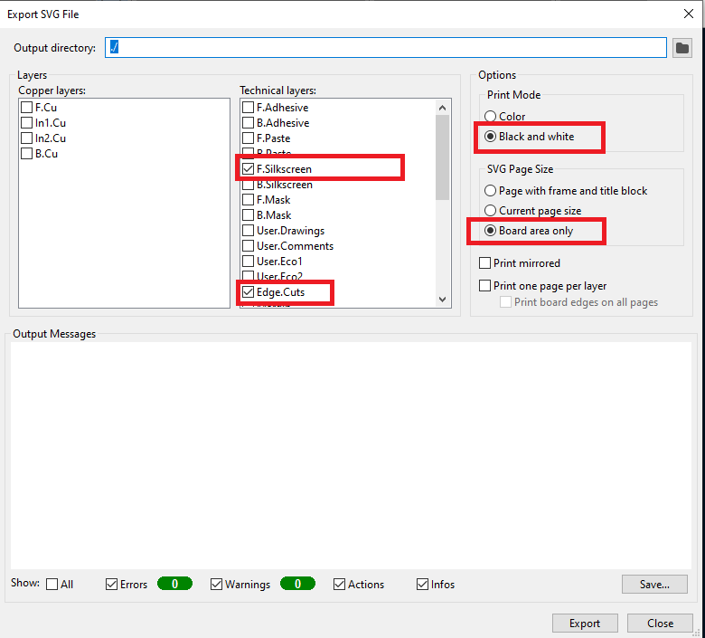
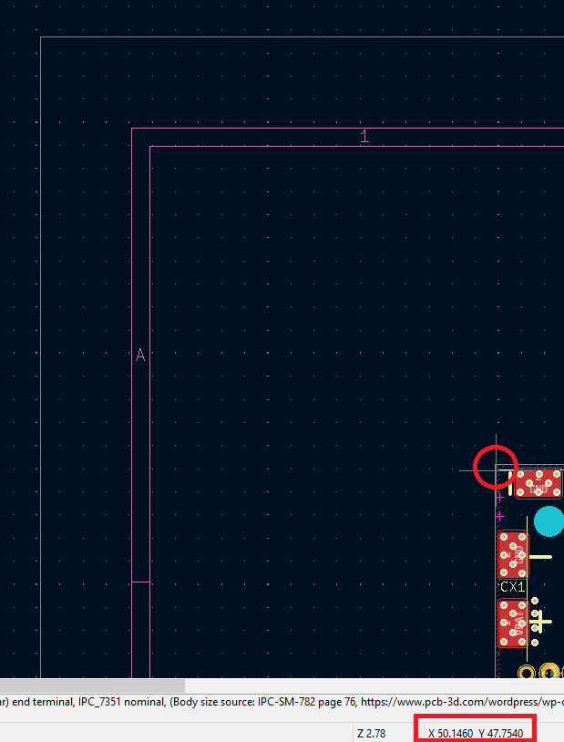

# Pick and place helper

This tool is to help electronic DIYers to place electronic components on the PCB (aka Pick & place).

Tested only on Windows.
Tested only with EasyEDA exports (SVG and pick&place CSV).

# Installation

It requires Python 3.

Install python libraries :
```
pip install -r requirements.txt
```

You must also install [Uniconverter](requires_install\uniconvertor-2.0rc5-win64_headless.msi)

# Tips EasyEDA

You must center your design in the lower right corner of the PCB diagram.



If you don't use the offsets arguments to place the components correctly.


# Usage

## With EasyEDA

Export SVG :


I advise those settings :


## With Kicad

Export SVG with those settings :



Find offsets at the upper left corner of your pcb :




## Shell command

Options :
```
-s :Input file SVG", required=True)
-c :input csv positions (aka Pick & Place)
-x : input format [easyeda|kicad_jlcpcb|kicad_original]
-f : Designator filter (regexp)
-ox : offset X for component placement
-oy : offset Y for component placement
```

Usage :
```
python pick_and_place_helper.py -s <path_to_svg_pcb_file>.svg -c <path_to_pick_and_place_file>.csv -x <easyeda|kicad_original|kicad_jlcpcb> -ox <offset_x> -oy <offset_y>
```

The "kicad_jlcpcb" Pick & Place format is reserved for exports made with JLCKicadTools (https://dubiouscreations.com/2019/10/21/using-kicad-with-jlcpcb-assembly-service/).
Use "kicad_originak" for exports made directly from Kicad.

Examples:
```
python pick_and_place_helper.py -s .\test_easyeda\pcb1.svg -c .\test_easyeda\pcb1.csv -x easyeda
python pick_and_place_helper.py -s .\test_kicad\pcb2-brd.svg -c .\test_kicad\pcb2_cpl_jlc.csv -x kicad_jlcpcb -ox 49.5 -oy 46.8
python pick_and_place_helper.py -s .\test_kicad\pcb2-brd.svg -c .\test_kicad\pcb2-all-pos.csv -x kicad_original -ox 49.5 -oy 46.8
```

You can also filter desingations with a regular expression (here, it will output only resistors and capacitors):
```
python pick_and_place_helper.py -s .\test_easyeda\pcb1.svg -c .\test_easyeda\pcb1.csv -x easyeda -f "^[R|C]d+$"
```
It will output only components with designation starting with R (resistors) and C (capacitors).


# Results

It outputs a PDF next to your SVG file.
Each page is for a specific component (same footprint, same type, same value).

You your printer options, you can adjust multiple pages on a A4 pages if you want.

Check example folder.

Example :

