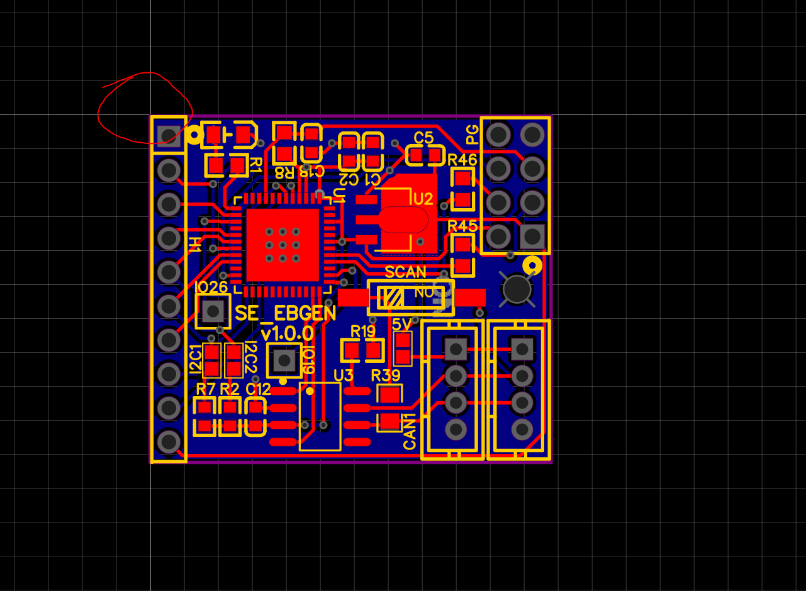

This tool is to help electronic DIYers to place electronic components on the PCB (aka Pick & place).

Tested only on Windows.
Tested only with EasyEDA exports (SVG and pick&place CSV).

# Installation

It requires Python 3.

You must also install [Uniconverter](requires_install\uniconvertor-2.0rc5-win64_headless.msi)

# EasyEDA Requirements

You must center your design in the lower right corner of the PCB diagram.

# Usage

`python pick_and_place_helper.py <path_to_svg_pcb_file>.svg <path_to_pick_and_place_file>.csv`

You can also filter desingations with a regular expression :
`python pick_and_place_helper.py <path_to_svg_pcb_file>.svg <path_to_pick_and_place_file>.csv "^[R|C]d+$"`

It will output only components with designation starting with R (resistors) and C (capacitors).

# Results

It output a PDF next to your SVG file with one component type by page.
You your printer options, you can adjust multiple pages on a A4 pages if you want.

Each page is for a specific component (same footprint, same type, same value).

Example :

